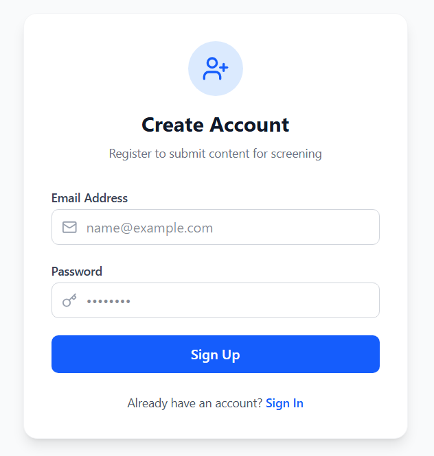
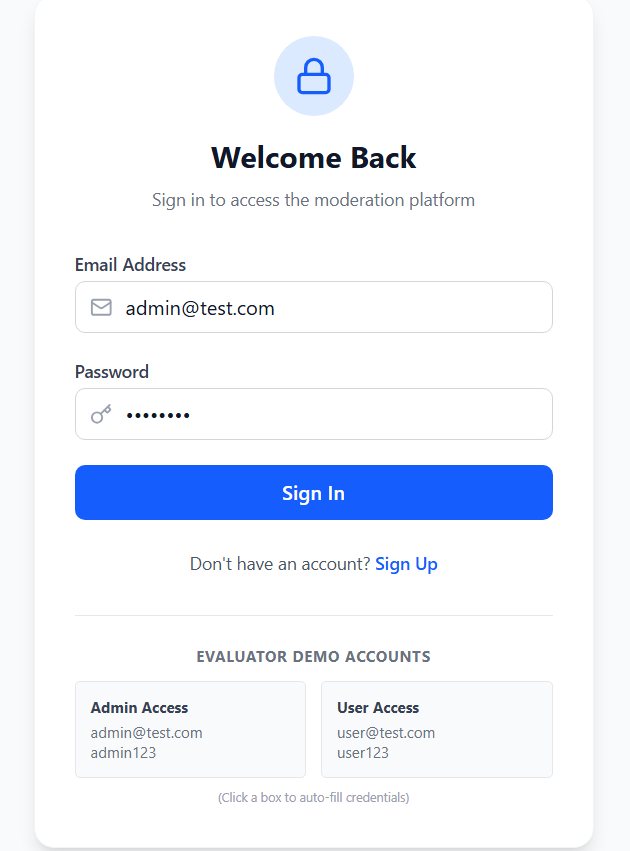
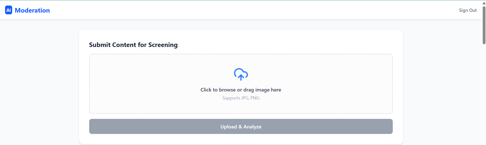
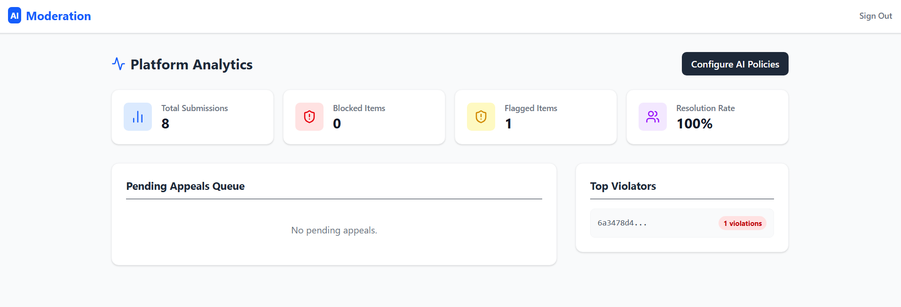
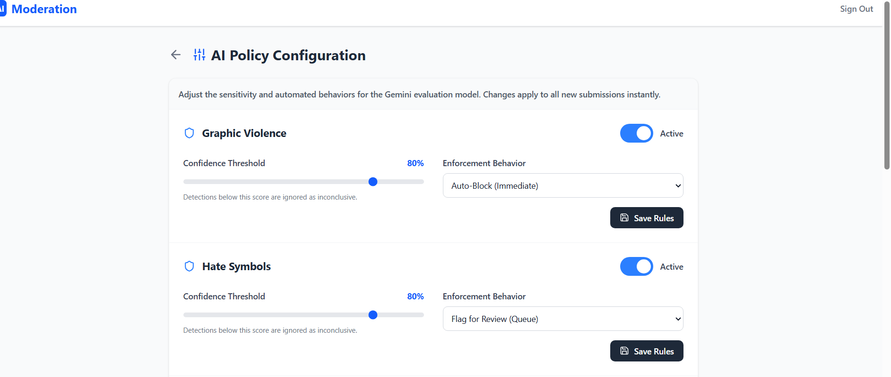
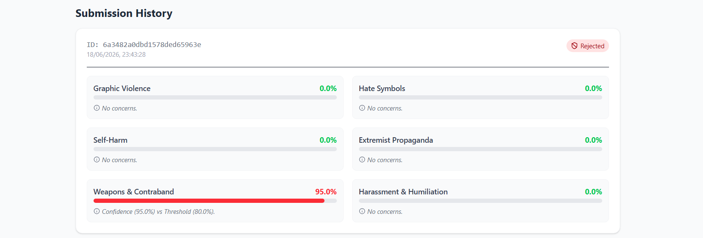

<div align="center">

# 🛡️ AI Content Moderator

### Intelligent AI-Powered Content Moderation System

*A robust, full-stack application designed to automatically detect and flag harmful content using advanced Large Language Models. Built for precision, security, and scalability.*

[](https://fastapi.tiangolo.com/)
[](https://react.dev/)
[](https://ai.google.dev/)
[](https://www.mongodb.com/)
[](https://tailwindcss.com/)

</div>

---

## 📋 Table of Contents

- [Overview](#-overview)
- [Key Features](#-key-features)
- [Moderation Categories](#-moderation-categories)
- [User Roles](#-user-roles)
- [System Architecture](#-system-architecture)
- [Tech Stack](#-tech-stack)
- [Database Schema](#-database-schema)
- [Getting Started](#-getting-started)
- [API Endpoints](#-api-endpoints)
- [Screenshots](#-screenshots)
- [Future Enhancements](#-future-enhancements)
- [Author](#-author)

---

## 🌿 Overview

**AI Content Moderator** is a comprehensive solution designed to protect digital platforms by analyzing user-uploaded images for potential safety violations. By integrating the Gemini API, the platform provides real-time, algorithmic content analysis to categorize and flag harmful media before it hits your database.

The application ensures safety through a multi-tiered filtering system, offering administrators full control over moderation policies and confidence thresholds.

The platform is built around four core pillars:

- **Automated Detection** — Gemini-powered vision analysis classifies uploaded images across all six sensitive content categories, returning a confidence score and reasoning summary per category.
- **Policy-Driven Enforcement** — Admins independently configure each category: enable or disable it, set confidence thresholds, and choose between Auto-Block or Flag for Review enforcement.
- **Structured Appeal Workflow** — Users can dispute any Flagged or Blocked verdict with a written justification. Admins review appeals, attach responses, and accepted appeals automatically override the verdict to Approved.
- **Centralized Review & Analytics** — A unified dashboard for monitoring submissions, managing the appeal queue, and a dedicated admin analytics view covering verdict trends, category breakdowns, and user activity.

---

## ✨ Key Features

| Feature | Description |
|---|---|
| 🤖 **AI-Driven Analysis** | Gemini LLM vision analyzes images across all six sensitive content categories, returning a confidence score and reasoning string per category. |
| ⚙️ **Configurable Policies** | Administrators independently control each category: enable/disable it entirely, set confidence thresholds, and choose enforcement behavior (Flag vs. Auto-Block). |
| 📊 **Unified Dashboard** | An intuitive interface for monitoring, reviewing, and managing flagged and blocked content submissions. |
| 🏛️ **Appeal Workflow** | Users can dispute Flagged or Blocked verdicts with a written justification. Admins review the queue, attach written responses, and accepted appeals automatically override verdicts to Approved. |
| 📈 **Analytics Dashboard** | Admin-only view with submission volume over time, verdict distribution by outcome and category, appeal resolution rates, and a ranked leaderboard of users by submission and violation count. |
| 🛡️ **Role-Based Security** | Secure JWT-based authentication with distinct User and Admin roles, each with non-overlapping capabilities. |
| 🚀 **High-Performance Pipeline** | Asynchronous multi-image processing with intelligent retry logic, fallback safety mechanisms, and per-image independent verdicts. |
| 📁 **Submission History** | Persistent storage of past submissions, verdicts, policy snapshots, and moderation outcomes for auditing, filtering by status/category/date, and trend analysis. |

---

## 🚨 Moderation Categories

Every submitted image is screened against all **active** moderation categories. For each category, the system produces a classification result, a confidence score, and a short reasoning summary from Gemini.

| Category | Description |
|---|---|
| 🩸 **Graphic Violence** | Depictions of physical harm, gore, or serious injury to humans or animals. |
| ☠️ **Hate Symbols** | Imagery associated with extremist ideologies or designated terrorist organizations. |
| 🔪 **Self-Harm** | Visual content depicting or glorifying acts of self-inflicted injury. |
| 📢 **Extremist Propaganda** | Content that promotes, recruits for, or glorifies violent extremist movements. |
| 🔫 **Weapons & Contraband** | Imagery depicting illegal weapons, drug manufacturing, or trafficking-related content. |
| 😡 **Harassment & Humiliation** | Imagery intended to degrade, threaten, or publicly humiliate an identifiable individual. |

---

## 👥 User Roles

The system has two distinct roles with non-overlapping capabilities.

| Role | Capabilities |
|---|---|
| **User** | Register, log in, submit images (single or batch), view personal submission history with filters, file appeals, and track appeal status. |
| **Admin** | All user capabilities, plus: access the appeals queue, accept or reject appeals with written responses, override verdicts manually, configure moderation policies per category, and access the analytics dashboard. |

---

## 🏗️ System Architecture

AI Content Moderator follows a decoupled **Client-Server** architecture optimized for asynchronous AI processing:

```
┌─────────────────┐     ┌─────────────────┐     ┌─────────────────┐
│   Frontend      │────▶│   Backend       │────▶│   Database      │
│   (React)       │     │   (FastAPI)     │     │   (MongoDB)     │
│                 │◀────│                 │◀────│                 │
│ • Upload UI     │     │ • Auth (JWT)    │     │ • Submissions   │
│ • Dashboard     │     │ • Moderation    │     │ • Policies      │
│ • Policy Config │     │   Pipeline      │     │ • User Roles    │
└─────────────────┘     └────────┬────────┘     └─────────────────┘
                                 │
                        ┌────────▼────────┐
                        │   AI Layer      │
                        │ (Gemini Vision) │
                        │ • Classify      │
                        │ • Confidence    │
                        │ • Fail-Safe     │
                        └─────────────────┘
```

- **Frontend (React):** Handles image uploads, dashboard rendering, and policy configuration via Tailwind CSS.
- **Backend (FastAPI):** Performs request validation, authentication, and orchestrates the moderation pipeline.
- **AI Layer (Gemini API):** Analyzes submitted images against configured categories and returns confidence-scored classifications, with a fail-safe fallback if the service is unreachable.
- **Database (MongoDB):** Stores user accounts, submission records, moderation results, and policy configuration documents.

---

## 🛠️ Tech Stack

| Layer | Technology |
|---|---|
| **Frontend** | React, Vite, Tailwind CSS, Axios |
| **Backend** | FastAPI (Python), Uvicorn |
| **Containerization** | Docker, Docker Compose |
| **Database** | MongoDB |
| **AI/ML** | Google Gemini API (Vision) |
| **Authentication** | JWT, Bcrypt |

---

## 🗄️ Database Schema

The application uses a MongoDB document structure managed through Python data models:

```python
# Core Collections Representation

User {
    "_id":       ObjectId,
    "name":      str,
    "email":     str,        # unique
    "password":  str,        # bcrypt hash
    "role":      str,        # "ADMIN" | "USER"
}

Submission {
    "_id":            ObjectId,
    "imageData":      str,       # Base64 encoded string
    "fileName":       str,
    "status":         str,       # "PENDING" | "FLAGGED" | "BLOCKED" | "APPROVED"
    "verdicts":       list,      # Per-category breakdown (see Verdict structure below)
    "confidence":     float,     # Highest confidence score across all categories (0.0 - 1.0)
    "policySnapshot": dict,      # Copy of active policy config at time of submission
    "submittedBy":    ObjectId,  # ref -> User
    "createdAt":      datetime,
}

# Per-category verdict structure (stored inside Submission.verdicts list)
CategoryVerdict {
    "category":    str,     # e.g. "graphic_violence"
    "result":      str,     # "CLEAN" | "FLAGGED" | "BLOCKED"
    "confidence":  float,   # 0.0 - 1.0
    "reasoning":   str,     # Short summary from Gemini explaining the classification
}

Policy {
    "_id":        ObjectId,
    "category":   str,      # "graphic_violence" | "hate_symbols" | "self_harm" |
                            # "extremist_propaganda" | "weapons_contraband" | "harassment_humiliation"
    "enabled":    bool,     # If False, category is skipped entirely during screening
    "threshold":  float,    # Confidence threshold (0.0 - 1.0); detections below this are inconclusive
    "action":     str,      # "FLAG" | "AUTO_BLOCK"
    "updatedBy":  ObjectId, # ref -> User
    "updatedAt":  datetime,
}

Appeal {
    "_id":            ObjectId,
    "submission":     ObjectId,  # ref -> Submission
    "filedBy":        ObjectId,  # ref -> User
    "justification":  str,       # User's written explanation for the dispute
    "status":         str,       # "PENDING" | "ACCEPTED" | "REJECTED"
    "adminResponse":  str,       # Optional written response from the reviewing admin
    "reviewedBy":     ObjectId,  # ref -> User (admin)
    "createdAt":      datetime,
    "reviewedAt":     datetime,
}
```

---

## 🚀 Getting Started

### Prerequisites

Ensure the following are installed before running the project:

- [Node.js](https://nodejs.org/) (v18+)
- [Python](https://www.python.org/) (v3.10+)
- [MongoDB](https://www.mongodb.com/)
- [Docker](https://www.docker.com/) & [Docker Compose](https://docs.docker.com/compose/) (for containerized setup)

### Running with Docker (Recommended)

The easiest way to run the entire stack is with a single command:

```bash
git clone https://github.com/ZainAbbas-dev/ai-content-moderator.git
cd ai-content-moderator
```

Create a `.env` file in the project root:

```env
MONGO_URI="mongodb://mongo:27017/ai-content-moderator"
GEMINI_API_KEY="your_gemini_api_key"
JWT_SECRET="your_secret_key"
```

Then start all services:

```bash
docker-compose up
```

The application will be live at **http://localhost:5173** and the API at **http://localhost:8000**.

### Manual Installation

**1. Clone the Repository**

```bash
git clone https://github.com/ZainAbbas-dev/ai-content-moderator.git
cd ai-content-moderator
```

**2. Backend Setup**

```bash
cd backend
pip install -r requirements.txt
```

Create a `.env` file inside the `/backend` directory:

```env
MONGO_URI="mongodb://localhost:27017/ai-content-moderator"
GEMINI_API_KEY="your_gemini_api_key"
JWT_SECRET="your_secret_key"
PORT=8000
```

Run the development server:

```bash
uvicorn main:app --reload --port 8000
```

**3. Frontend Setup**

```bash
cd ../frontend
npm install
npm run dev
```

The application will be live at **http://localhost:5173**.

---

## 📡 API Endpoints

| Method | Endpoint | Description |
|---|---|---|
| `POST` | `/api/auth/register` | Creates a new account, hashes the password, and assigns a user role |
| `POST` | `/api/auth/login` | Authenticates a user and returns a JWT with role information |
| `POST` | `/api/moderate` | Submits one or more images for AI-based moderation; each image is screened independently and receives its own verdict |
| `GET` | `/api/submissions` | Fetches all moderation submissions with optional filtering by status, category, and date |
| `GET` | `/api/submissions/:id` | Retrieves the full details of a specific submission including per-category verdicts and policy snapshot |
| `GET` | `/api/policies` | Returns the current set of moderation policies and their configuration |
| `PUT` | `/api/policies/:category` | Updates the enabled state, confidence threshold, and enforcement action for a category |
| `POST` | `/api/appeals` | Files an appeal against a Flagged or Blocked submission with a written justification |
| `GET` | `/api/appeals` | Returns the pending appeals queue (admin only) |
| `GET` | `/api/appeals/:id` | Retrieves details of a specific appeal |
| `PUT` | `/api/appeals/:id/review` | Accepts or rejects an appeal with an optional written admin response; acceptance overrides the verdict to Approved |
| `GET` | `/api/analytics/overview` | Returns platform-wide stats: submission volume over time, verdict distribution by outcome and category |
| `GET` | `/api/analytics/appeals` | Returns appeal volume, resolution rate, and accepted vs. rejected breakdown |
| `GET` | `/api/analytics/users` | Returns a ranked list of users by submission count and by violation count (admin only) |

---

## 📸 Screenshots

| Screen | Preview |
|---|---|
| Sign Up Screen |  |
| Login Screen |  |
| Upload & Moderation Result |  |
| Moderation Dashboard |  |
| Policy Configuration |  |
| Submission History |  |
| Appeal Filing |  |
| Appeal Queue (Admin) |  |
| Analytics Dashboard |  |

---

## 🔮 Future Enhancements

- 📝 **Text Moderation** — Extend the pipeline to analyze user-submitted text alongside images.
- 🎥 **Video Frame Sampling** — Support moderation of video uploads by sampling and analyzing key frames.
- 🔔 **Real-Time Alerts** — WebSocket-based notifications for moderators when high-confidence violations are flagged.
- 📈 **Analytics Dashboard** — Visual trend reporting on flagged content volume, category breakdown, and moderator activity.
- 🌍 **Multi-language Support** — Localization of the moderation dashboard for broader accessibility.

---

## 👨‍💻 Author

**Muhammad Zain Abbas**

> *Computer Science Student · Full Stack Developer & Aspiring Machine Learning Engineer*
>
> Passionate about building robust, practical software solutions that prioritize structural correctness and intelligent algorithmic design.

📧 [iamzainabbass@gmail.com](mailto:iamzainabbass@gmail.com)
🐙 [GitHub](https://github.com/ZainAbbas-dev)

---

<div align="center">

*If you found this project useful, consider giving it a ⭐ on GitHub!*

</div>